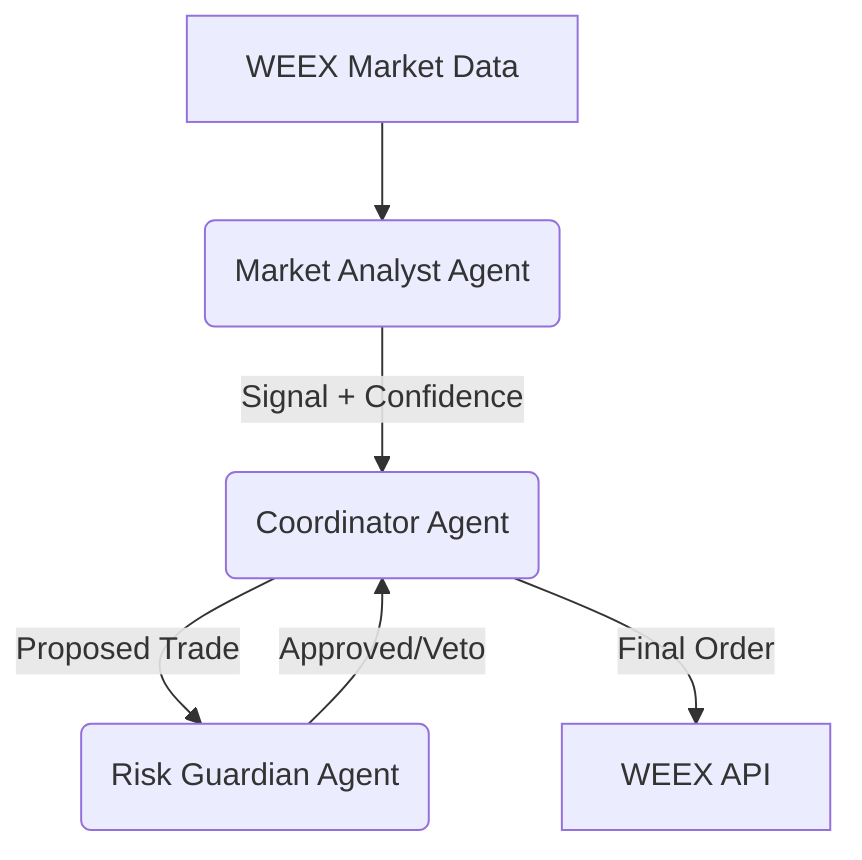

# 🏗️ Neuro-Symbolic Agent Architecture

## Why fewer folders than Fenyr?
Fenyr is built as a **Framework** (like a LEGO set) to let people build *any* bot.
Your bot is a **Scalpel**—a precision instrument built for exactly ONE strategy (Winning the WEEX Hackathon).

We cut the bloat. We kept the muscle.

## 📂 The Structure

### `src/agents/` (The Brain Trust)
This is where the "Multi-Agent" magic happens.

*   **`coordinator.py` (The Boss)** 👮‍♂️
    *   **Role**: Orchestrates the team. It doesn't analyze; it *decides*.
    *   **Workflow**: `Coordinator` -> asks `Analyst` -> gets Signal -> asks `Risk` -> gets Approval -> Decision.
    *   **Analog**: The Hedge Fund Manager.

*   **`market_analyst.py` (The Brain)** 🧠
    *   **Role**: Pure Analysis.
    *   **Components**:
        *   **Eyes**: `RegimeClassifier` (Is the market safe? Calm? Crashing?)
        *   **Brain**: `AlphaEngine` (DQN/ML model predicting price direction).
    *   **Analog**: The Lead Quant Researcher.

*   **`risk_guardian.py` (The Shield)** 🛡️
    *   **Role**: Absolute VETO power.
    *   **Logic**: "I don't care how good the signal is; if we are down 5%, we stop."
    *   **Analog**: The Compliance Officer.

### `src/api/` (The Hands)
*   **`weex_client.py`**: Talk to WEEX (REST API).
*   **`websocket_client.py`**: Listen to WEEX (Real-time Stream).

### `src/strategy/` (The Toolkit)
*   Helper math and signal calculation libraries used by the Analyst.

---

## 🚀 Data Flow Diagram

